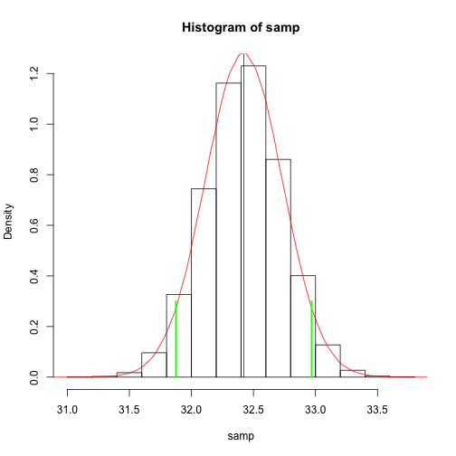

---
title: "Review of basic statistical concepts"
subtitle: "Ecological Data Management and Analysis"
author: "Achaz von Hardenberg"
date: "10 Nov 2014"
output:
  ioslides_presentation:
    logo: eco_wordle.jpg
    widescreen: true
    incremental: true
---  

## Introducing the Dahu
  
<iframe width="420" height="315" src="//www.youtube.com/embed/BBMVraJZoAU" frameborder="0" allowfullscreen></iframe>  
   
## Ok, we have got the data... and now? {.build}

Measures of **Central tendency:**

*Mean*  

*Median*

*Mode*

## The Mean {.build}

$\large{\frac{\sum{x}}{n}}$    


```r
dahu.dat<-read.csv("dahu.csv")
dahuM.dat<-subset(dahu.dat,Sex==1)
dahuF.dat<-subset(dahu.dat,Sex==0)
```


```r
meanMR<-sum(dahuM.dat$R)/length(dahuM.dat$R)
```


```r
meanMR
```

```
## [1] 34.75
```
But of course there must be a function for this, right?  

```r
mean(dahuM.dat$R)
```

```
## [1] 34.75
```

## The Median {.build}  

The Median is the value dividing the sample exactly in half (in a sorted list of numbers).


```r
dahuM.dat<-dahuM.dat[order(dahuM.dat$R),]
```
 

```r
length(dahuM.dat$R)/2
```

```
## [1] 33.5
```


```r
dahuM.dat$R[34]
```

```
## [1] 35.13
```


```r
median(dahuM.dat$R)
```

```
## [1] 35.13
```

## The Normal distribution {.build} 

The sample mean ($\overline{x} = 34.75$) and the median ($\tilde{x} = 35.13$) look very similar... why is that?  


```r
hist(dahuM.dat$R)
```

 

## The Normal distribution

The sample mean ($\overline{x} = 34.75$) and the median ($\tilde{x} = 35.13$) look very similar... why is that?  


```r
hist(dahuM.dat$R,prob=T)
```

 


## The Normal distribution


```r
hist(dahuM.dat$R,prob=T)
lines(density(rnorm(1000000,mean(dahuM.dat$R),sd(dahuM.dat$R))),col="red")
```

 

## The Normal distribution


```r
hist(dahuM.dat$R,prob=T)
lines(density(rnorm(1000000,mean(dahuM.dat$R),sd(dahuM.dat$R))),col="red")
segments(mean(dahuM.dat$R),0,mean(dahuM.dat$R),0.2,col="blue")
```

 

## The Normal distribution


```r
hist(dahuM.dat$R,prob=T)
lines(density(rnorm(1000000,mean(dahuM.dat$R),sd(dahuM.dat$R))),col="red")
segments(mean(dahuM.dat$R),0,mean(dahuM.dat$R),0.2,col="blue")
segments(median(dahuM.dat$R),0,median(dahuM.dat$R),0.2,col="green")
```

 

## The Mode {.build}

The mode is the number which appears most often in a sample (works with integers)

```r
x <- c(1,2,2,2,3,4,5,6,7,8,9)
```


```r
temp <- table(as.vector(x))
```


```r
names(temp)[temp == max(temp)]
```

```
## [1] "2"
```

## The Mode {.build}  

For continous data in `R`: 

```r
library(modeest)
```

```
## 
## This is package 'modeest' written by P. PONCET.
## For a complete list of functions, use 'library(help = "modeest")' or 'help.start()'.
```

```r
mlv(dahuM.dat$R,method="mfv")
```

```
## Mode (most likely value): 34.75 
## Bickel's modal skewness: 0.07463 
## Call: mlv.default(x = dahuM.dat$R, method = "mfv")
```

## Measures of dispersion {.build}  

Simplest one: the **Range** : The smallest and the largest values in your sample   

```r
range(dahuM.dat$R)
```

```
## [1] 30.76 38.78
```
  
**Quantiles** : the values that divide a list of numbers into regular intervals.

The most used quantile are the 4-quantiles (called also **quartiles**).
In R, quartiles are the default for the function `quantile` : 


```r
quantile(dahuM.dat$R)
```

```
##    0%   25%   50%   75%  100% 
## 30.76 33.39 35.13 35.81 38.78
```
  
We actually have already seen an other **quantile**... which one?

## Measures of dispersion {.build}  

The **Median**!  
whiich is the value dividing the sample exactly in half (in a sorted list of numbers): and it is thus the **2-quantile**


```r
median(dahuM.dat$R)
```

```
## [1] 35.13
```


```r
quantile(dahuM.dat$R)
```

```
##    0%   25%   50%   75%  100% 
## 30.76 33.39 35.13 35.81 38.78
```

In the table above, can you identify the lower and upper ranges, the quartiles and the median?

## The boxplot {.build}
To represent the quartiles (and compare samples) graphically, a convenient way is using the `boxplot`

```r
boxplot(dahuF.dat$L,dahuF.dat$R,ylim=c(10,45), 
        boxwex = 0.30, at = 1:2 - 0.2,
         names=c("Left leg","Right leg"), 
         col="pink")
boxplot(dahuM.dat$L,dahuM.dat$R, ylim=c(10,45),
        boxwex = 0.30, at = 1:2 + 0.2, add=T, 
        col="lightblue")
```

## The boxplot {.build}
To represent the quartiles (and compare samples) graphically, a convenient way is using a `boxplot` (Box-and-Whisker plot) 
 
  
## The boxplot
To represent the quartiles (and compare samples) graphically, a convenient way is using a `boxplot` (Box-and-Whisker plot) 
 
 

```r
legend(0.3,44, c("Females","Males"),fill = c("pink", "lightblue"))
```

## The boxplot


## Variance {.build}
  
$\sigma^2=\frac{\sum{(x-\overline{x}})^2}{n-1}$


```r
var.dahu <- sum((dahu.dat$R-mean(dahu.dat$R))^2)/(length(dahu.dat$R)-1)
var.dahu
```

```
## [1] 9.731
```

```r
var(dahu.dat$R)
```

```
## [1] 9.731
```


## Standard Deviation {.build}  

$\sigma=\sqrt{\sigma^2}$

Usefull property of the standard deviation is that it is expressed in the same units as the data, while the variance is not! (ex. in the dahu example  it is in $cm^2$ rather than in $cm$)


```r
sqrt(var(dahu.dat$R))
```

```
## [1] 3.119
```

```r
sd(dahu.dat$R)
```

```
## [1] 3.119
```


## Why square the differences? {.build}  
  
  
... Taken from [www.mathisfun.com](http://www.mathsisfun.com/data/standard-deviation.html)

## Why square the differences? {.build}  
  
Taken from [www.mathisfun.com](http://www.mathsisfun.com/data/standard-deviation.html)


## Standard Error {.build}

The *standard error of the mean* is a measure of the precision of the estimate of the true population mean given your sample.  
  
It dependes on the sample size

$\large{SEM={\frac{\sigma}{\sqrt{n}}}}$  


```r
se.dahu<-sd(dahu.dat$R)/sqrt(length(dahu.dat$R))
se.dahu
```

```
## [1] 0.279
```

```r
mean(dahu.dat$R)
```

```
## [1] 32.42
```

## Standard Error and Standard Devitation {.build}
  
"The **standard error** of the sample is an estimate of how far the sample mean is likely to be from the population mean, whereas the **standard deviation** of the sample is the degree to which individuals within the sample differ from the sample mean" (http://en.wikipedia.org/wiki/Standard_error).

## The central limit theorem  

<iframe width="420" height="315" src="//www.youtube.com/embed/JNm3M9cqWyc" frameborder="0" allowfullscreen></iframe>

... http://www.khanacademy.org/


## The central limit theorem {.build}  

The **sampling distribution** of the sums of samples (and thus their means) taken from a population with any distribution, approximates a normal distribution    

(the more the samples, the better the approximation!)

```r
par(mfrow=c(1,2))
hist(dahu.dat$R)
```
  

```r
segments(mean(dahu.dat$R),0,mean(dahu.dat$R),40,col="red")
```
  

```r
samp<-seq(1,10000)
for (i in 1:10000)
{
samp[i]<-mean(sample(dahu.dat$R,5,replace=T))
}
```
  

```r
hist(samp)
segments(mean(dahu.dat$R),0,mean(dahu.dat$R),2000,col="red")
```

## The central limit theorem {.build}

 

## The central limit theorem {.build}


```r
mean(dahu.dat$R)
```

```
## [1] 32.42
```

```r
mean(samp)
```

```
## [1] 32.43
```

## The central limit theorem {.build}
  

```r
par(mfrow=c(1,2))  
rpop<-runif(10000)
```
  

```r
hist(rpop)
segments(mean(rpop),0,mean(rpop),1000,col="blue",lwd=2)  
```
  

```r
samp2<-seq(1,10000)
```
  

```r
for (i in 1:10000)   
{
samp2[i]<-mean(sample(rpop,5,replace=T))
} 
```
  

```r
hist(samp2)  
segments(mean(rpop),0,mean(rpop),2000,col="blue",lwd=2)
```

## The central limit theorem {.build}
 


## Confidence intervals {.build}


```r
hist(dahu.dat$R)
segments(mean(dahu.dat$R),0,mean(dahu.dat$R),2000,col="blue",lwd=2)
```

## Confidence intervals

 

## Confidence intervals {.build}

The **Confidence Interval** represent the interval of values between which a certain percentage of repeated samples (e.g. 95%) from a population include the true estimate (in our example, the mean) 
  
1. Any single sample mean is one of many possible sample means that might have been found for different random samples. All those other possible sample means form  **the sampling distribution of the mean**;  
2. The sampling distribution of the mean is normal in shape, regardless of the shape of the population distribution (remember the Central Limit Theorem!);  
3. The mean of the sampling distribution of the mean is the same as the population mean;  
4. The standard deviation of the sampling distribution of the mean can be estimated by dividing the standard deviation of the sample by the square root of n (this is known as the Standard Error of the sample);   
  
http://www.gla.ac.uk/sums/users/lhornibrook/Sensor_Comparisons/confid3.html
  

## Confidence intervals {.build}  

Let's add the 95% Confidence Intervals to the histogram of the right legs of Dahu. For this, we use the $z-score$, which is the number of standard deviation values which include the 95% of random samples


```r
se.dahu<-sd(dahu.dat$R)/sqrt(length(dahu.dat$R))
sampCI.Plus<-mean(dahu.dat$R)+se.dahu*1.96
sampCI.Minus<-mean(dahu.dat$R)-se.dahu*1.96
```


```r
segments(sampCI.Plus,0,sampCI.Plus,30,col="green",lwd=2)
segments(sampCI.Minus,0,sampCI.Minus,30,col="green",lwd=2)
```

## Confidence intervals

 

## Confidence intervals {.build}  

```r
sampCI.Plus
```

```
## [1] 32.97
```

```r
sampCI.Minus
```

```
## [1] 31.87
```

```r
t.test(dahu.dat$R)
```

```
## 
## 	One Sample t-test
## 
## data:  dahu.dat$R
## t = 116.2, df = 124, p-value < 2.2e-16
## alternative hypothesis: true mean is not equal to 0
## 95 percent confidence interval:
##  31.87 32.97
## sample estimates:
## mean of x 
##     32.42
```
  
## Confidence intervals {.build} 


```r
samp<-seq(1,100000)
for (i in 1:100000)
{
samp[i]<-mean(sample(dahu.dat$R,100,replace=T))
}
hist(samp, prob=T)
segments(mean(samp),0,mean(samp),2000,col="blue")
lines(density(rnorm(1000000,mean(samp),sd(samp))),col="red")
se.samp<-sd(samp)
sampCI2.Plus<-mean(samp)+se.samp*1.96
sampCI2.Minus<-mean(samp)-se.samp*1.96
segments(sampCI.Plus,0,sampCI.Plus,0.3,col="green",lwd=2)
segments(sampCI.Minus,0,sampCI.Minus,0.3,col="green",lwd=2)
```

## Confidence intervals

 

## Properties of the normal distribution

<iframe width="420" height="315" src="//www.youtube.com/embed/FXZ2O1Lv-KE" frameborder="0" allowfullscreen></iframe>


